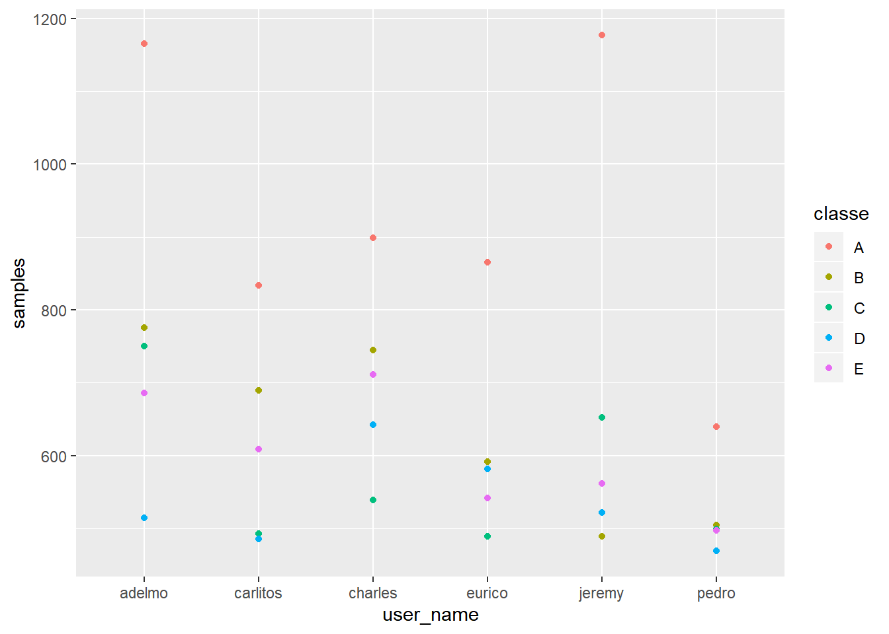
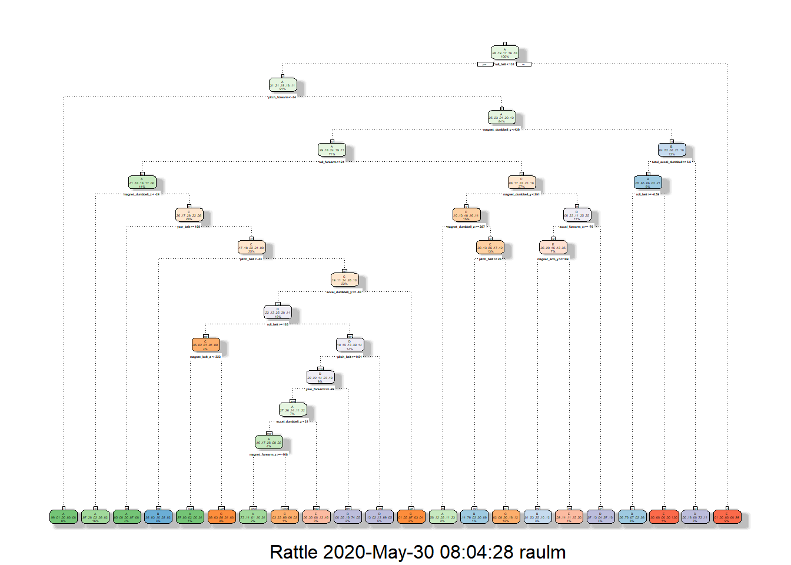

## Summary
One thing that people regularly do is quantify how much of a particular activity they do, but they rarely quantify how well they do it. In this project, data from accelerometers on the belt, forearm, arm, and dumbell of 6 participants is used.

Two prediction models, Decision Tree and Random Forest, have been built to predict the quality of the execution of the exercises using a training data set of more than 10k samples. As a result, Random Forest performed the best and was used to run predictions for 20 additional samples.

## Exploratory data analysis

Training and testing data sets are downloaded from https://d396qusza40orc.cloudfront.net/predmachlearn


```r
training <- read.csv('https://d396qusza40orc.cloudfront.net/predmachlearn/pml-training.csv')

testing <- read.csv('https://d396qusza40orc.cloudfront.net/predmachlearn/pml-testing.csv')
```


```r
print(rbind(training = c(obs = dim(training)[1], vars = dim(training)[2]),
            testing = c(obs = dim(testing)[1], vars = dim(testing)[2])))
```

```
##            obs vars
## training 19622  160
## testing     20  160
```

The variable classe in the training set indicates the manner in which they did the exercise. Let's look at the number of samples each classe has:

```r
with(training, table(classe))
```

```
## classe
##    A    B    C    D    E 
## 5580 3797 3422 3216 3607
```

As indicated in HAR (Human Activity Recognition) project, "Class A corresponds to the specified execution of the exercise, while the other 4 classes correspond to common mistakes. Participants were supervised by an experienced weight lifter to make sure the execution complied to the manner they were supposed to simulate. The exercises were performed by six male participants aged between 20-28 years, with little weight lifting experience. We made sure that all participants could easily simulate the mistakes in a safe and controlled manner by using a relatively light dumbbell (1.25kg)".


```r
training %>% 
  group_by(user_name, classe) %>% 
  summarize(samples = n()) %>%
  ggplot(., aes(x = user_name, y = samples, color = classe)) + geom_point()
```

<!-- -->

For each of the 4 sensors (belt, arm, dumbbell and forearm) there are 38 variables from a set of measurements obtained from each sensor. For instance, for the belt:


```r
names(training)[grep("belt", names(training))]
```

```
##  [1] "roll_belt"            "pitch_belt"           "yaw_belt"            
##  [4] "total_accel_belt"     "kurtosis_roll_belt"   "kurtosis_picth_belt" 
##  [7] "kurtosis_yaw_belt"    "skewness_roll_belt"   "skewness_roll_belt.1"
## [10] "skewness_yaw_belt"    "max_roll_belt"        "max_picth_belt"      
## [13] "max_yaw_belt"         "min_roll_belt"        "min_pitch_belt"      
## [16] "min_yaw_belt"         "amplitude_roll_belt"  "amplitude_pitch_belt"
## [19] "amplitude_yaw_belt"   "var_total_accel_belt" "avg_roll_belt"       
## [22] "stddev_roll_belt"     "var_roll_belt"        "avg_pitch_belt"      
## [25] "stddev_pitch_belt"    "var_pitch_belt"       "avg_yaw_belt"        
## [28] "stddev_yaw_belt"      "var_yaw_belt"         "gyros_belt_x"        
## [31] "gyros_belt_y"         "gyros_belt_z"         "accel_belt_x"        
## [34] "accel_belt_y"         "accel_belt_z"         "magnet_belt_x"       
## [37] "magnet_belt_y"        "magnet_belt_z"
```

Inspecting these variables with str() function, it can be observed that the training data needs to be cleaned up:
1 - There are "#DIV/0!" values and should be replaced by NA
2 - Some of them are read as factor strings instead of numeric.

Data must be reimported by specifying in the read.csv() function to treat "#DIV/0!" and "NA" as NA.


```r
training <- read.csv('https://d396qusza40orc.cloudfront.net/predmachlearn/pml-training.csv', na.strings = c("#DIV/0!", "NA"))
testing <- read.csv('https://d396qusza40orc.cloudfront.net/predmachlearn/pml-testing.csv', na.strings = c("#DIV/0!", "NA"))
```


Finally, NA values must be removed. It can be observed that there are variables that are mostly NAs, so they can be removed from the list of predictors to use:


```r
obs <- dim(training)[1]
na_count <- sapply(training, function(x) sum(is.na(x)))
print(na_count[na_count > 0]/obs*100)
```

```
##       kurtosis_roll_belt      kurtosis_picth_belt        kurtosis_yaw_belt 
##                 97.98186                 98.09398                100.00000 
##       skewness_roll_belt     skewness_roll_belt.1        skewness_yaw_belt 
##                 97.97676                 98.09398                100.00000 
##            max_roll_belt           max_picth_belt             max_yaw_belt 
##                 97.93089                 97.93089                 97.98186 
##            min_roll_belt           min_pitch_belt             min_yaw_belt 
##                 97.93089                 97.93089                 97.98186 
##      amplitude_roll_belt     amplitude_pitch_belt       amplitude_yaw_belt 
##                 97.93089                 97.93089                 97.98186 
##     var_total_accel_belt            avg_roll_belt         stddev_roll_belt 
##                 97.93089                 97.93089                 97.93089 
##            var_roll_belt           avg_pitch_belt        stddev_pitch_belt 
##                 97.93089                 97.93089                 97.93089 
##           var_pitch_belt             avg_yaw_belt          stddev_yaw_belt 
##                 97.93089                 97.93089                 97.93089 
##             var_yaw_belt            var_accel_arm             avg_roll_arm 
##                 97.93089                 97.93089                 97.93089 
##          stddev_roll_arm             var_roll_arm            avg_pitch_arm 
##                 97.93089                 97.93089                 97.93089 
##         stddev_pitch_arm            var_pitch_arm              avg_yaw_arm 
##                 97.93089                 97.93089                 97.93089 
##           stddev_yaw_arm              var_yaw_arm        kurtosis_roll_arm 
##                 97.93089                 97.93089                 98.32841 
##       kurtosis_picth_arm         kurtosis_yaw_arm        skewness_roll_arm 
##                 98.33860                 97.98695                 98.32331 
##       skewness_pitch_arm         skewness_yaw_arm             max_roll_arm 
##                 98.33860                 97.98695                 97.93089 
##            max_picth_arm              max_yaw_arm             min_roll_arm 
##                 97.93089                 97.93089                 97.93089 
##            min_pitch_arm              min_yaw_arm       amplitude_roll_arm 
##                 97.93089                 97.93089                 97.93089 
##      amplitude_pitch_arm        amplitude_yaw_arm   kurtosis_roll_dumbbell 
##                 97.93089                 97.93089                 97.95638 
##  kurtosis_picth_dumbbell    kurtosis_yaw_dumbbell   skewness_roll_dumbbell 
##                 97.94109                100.00000                 97.95128 
##  skewness_pitch_dumbbell    skewness_yaw_dumbbell        max_roll_dumbbell 
##                 97.93599                100.00000                 97.93089 
##       max_picth_dumbbell         max_yaw_dumbbell        min_roll_dumbbell 
##                 97.93089                 97.95638                 97.93089 
##       min_pitch_dumbbell         min_yaw_dumbbell  amplitude_roll_dumbbell 
##                 97.93089                 97.95638                 97.93089 
## amplitude_pitch_dumbbell   amplitude_yaw_dumbbell       var_accel_dumbbell 
##                 97.93089                 97.95638                 97.93089 
##        avg_roll_dumbbell     stddev_roll_dumbbell        var_roll_dumbbell 
##                 97.93089                 97.93089                 97.93089 
##       avg_pitch_dumbbell    stddev_pitch_dumbbell       var_pitch_dumbbell 
##                 97.93089                 97.93089                 97.93089 
##         avg_yaw_dumbbell      stddev_yaw_dumbbell         var_yaw_dumbbell 
##                 97.93089                 97.93089                 97.93089 
##    kurtosis_roll_forearm   kurtosis_picth_forearm     kurtosis_yaw_forearm 
##                 98.35898                 98.36408                100.00000 
##    skewness_roll_forearm   skewness_pitch_forearm     skewness_yaw_forearm 
##                 98.35389                 98.36408                100.00000 
##         max_roll_forearm        max_picth_forearm          max_yaw_forearm 
##                 97.93089                 97.93089                 98.35898 
##         min_roll_forearm        min_pitch_forearm          min_yaw_forearm 
##                 97.93089                 97.93089                 98.35898 
##   amplitude_roll_forearm  amplitude_pitch_forearm    amplitude_yaw_forearm 
##                 97.93089                 97.93089                 98.35898 
##        var_accel_forearm         avg_roll_forearm      stddev_roll_forearm 
##                 97.93089                 97.93089                 97.93089 
##         var_roll_forearm        avg_pitch_forearm     stddev_pitch_forearm 
##                 97.93089                 97.93089                 97.93089 
##        var_pitch_forearm          avg_yaw_forearm       stddev_yaw_forearm 
##                 97.93089                 97.93089                 97.93089 
##          var_yaw_forearm 
##                 97.93089
```
It can be observed that all these variables are completely or almost (>97%) empty.

## Building a prediction model

Two important steps must be taken before training a prediction model:
* Data cleanup. Remove the variables that are almost empty.
* Split the data into training and test set for cross-validation.

For the data cleanup, a total of `{r length(na_count[na_count > 0])}`empty variables (>97% of NA values), in addition to "X", "user_name", "raw_timestamp_part_1", "raw_timestamp_part_2", "cvtd_timestamp", "new_window", "num_window", can be removed.


```r
dimensions_to_remove <- c(names(na_count[na_count > 0]), "X", "user_name", "raw_timestamp_part_1", "raw_timestamp_part_2", "cvtd_timestamp", "new_window", "num_window")

inTrain <- createDataPartition(training$classe, p = 0.6)[[1]]

train <- training[inTrain, ] %>% select(-dimensions_to_remove)
test <- training[-inTrain,] %>% select(-dimensions_to_remove)

print(rbind(train_set = c(obs = dim(train)[1], vars = dim(train)[2]),
            test_set = c(obs = dim(test)[1], vars = dim(test)[2])))
```

```
##             obs vars
## train_set 11776   53
## test_set   7846   53
```

### Decision-tree model

At a first step, a decision tree model can be built and verify the level of accuracy that can be obtained.


```r
model_dt <- rpart(classe ~ ., data = train, method = "class")
fancyRpartPlot(model_dt)
```

```
## Warning: labs do not fit even at cex 0.15, there may be some overplotting
```

<!-- -->


```r
pred_dt <- rpart.predict(model_dt, newdata = test, type = "class")
confusionMatrix(pred_dt, test$classe)
```

```
## Confusion Matrix and Statistics
## 
##           Reference
## Prediction    A    B    C    D    E
##          A 1997  332   27  127   46
##          B   50  820  153   50  110
##          C   51  202 1024   97  107
##          D   90   93  104  896   92
##          E   44   71   60  116 1087
## 
## Overall Statistics
##                                           
##                Accuracy : 0.7423          
##                  95% CI : (0.7325, 0.7519)
##     No Information Rate : 0.2845          
##     P-Value [Acc > NIR] : < 2.2e-16       
##                                           
##                   Kappa : 0.6727          
##  Mcnemar's Test P-Value : < 2.2e-16       
## 
## Statistics by Class:
## 
##                      Class: A Class: B Class: C Class: D Class: E
## Sensitivity            0.8947   0.5402   0.7485   0.6967   0.7538
## Specificity            0.9052   0.9426   0.9295   0.9422   0.9546
## Pos Pred Value         0.7896   0.6932   0.6914   0.7027   0.7888
## Neg Pred Value         0.9558   0.8952   0.9460   0.9406   0.9451
## Prevalence             0.2845   0.1935   0.1744   0.1639   0.1838
## Detection Rate         0.2545   0.1045   0.1305   0.1142   0.1385
## Detection Prevalence   0.3223   0.1508   0.1888   0.1625   0.1756
## Balanced Accuracy      0.9000   0.7414   0.8390   0.8195   0.8542
```

It can be seen that an accuracy of ~73% is obtained with a low p-Value, so the decision tree model is having overall good results but looking into more details it is not performing well. For instance, sensitivity for classes B and D are not goot at all, with an approx.50% of misclassified samples.

### Random forest model
In order to improve the metrics of decision tree model, random forest can be tried.


```r
model_rf <- randomForest::randomForest(classe ~ ., data = train, ntree = 1000)
```


```r
pred_rf <- predict(model_rf, newdata = test)
confusionMatrix(pred_rf, test$classe)
```

```
## Confusion Matrix and Statistics
## 
##           Reference
## Prediction    A    B    C    D    E
##          A 2230   13    0    0    0
##          B    1 1503   11    0    0
##          C    0    2 1356   12    2
##          D    0    0    1 1271    1
##          E    1    0    0    3 1439
## 
## Overall Statistics
##                                          
##                Accuracy : 0.994          
##                  95% CI : (0.992, 0.9956)
##     No Information Rate : 0.2845         
##     P-Value [Acc > NIR] : < 2.2e-16      
##                                          
##                   Kappa : 0.9924         
##  Mcnemar's Test P-Value : NA             
## 
## Statistics by Class:
## 
##                      Class: A Class: B Class: C Class: D Class: E
## Sensitivity            0.9991   0.9901   0.9912   0.9883   0.9979
## Specificity            0.9977   0.9981   0.9975   0.9997   0.9994
## Pos Pred Value         0.9942   0.9921   0.9883   0.9984   0.9972
## Neg Pred Value         0.9996   0.9976   0.9981   0.9977   0.9995
## Prevalence             0.2845   0.1935   0.1744   0.1639   0.1838
## Detection Rate         0.2842   0.1916   0.1728   0.1620   0.1834
## Detection Prevalence   0.2859   0.1931   0.1749   0.1622   0.1839
## Balanced Accuracy      0.9984   0.9941   0.9944   0.9940   0.9986
```

As expected, Random Forest is performing much better than Decision Tree. Actually, the confusion matrix metrics are really good, with 99% accuracy, sensitivity and specificity for every class.


## Predicting with the testing data


```r
predictions <- tibble(user_name = testing$user_name, predicted_classe = predict(model_rf, select(testing, -c(dimensions_to_remove, "problem_id"))))
table(predictions)
```

```
##           predicted_classe
## user_name  A B C D E
##   adelmo   1 0 0 0 0
##   carlitos 1 2 0 0 0
##   charles  1 0 0 0 0
##   eurico   1 2 0 0 1
##   jeremy   2 2 1 1 2
##   pedro    1 2 0 0 0
```


## Conclusion
The prediction model based on Random Forest seems to be very adequeate to predict the classe variable using the measurements from the relevant sensors. With an accuracy of 99%, we are in good position to predict the quality of the execution of the 20 additional samples that have been given.

## Data
The data for this project come from this source: http://web.archive.org/web/20161224072740/http:/groupware.les.inf.puc-rio.br/har. 

They have been very generous in allowing their data to be used for this kind of assignment.
